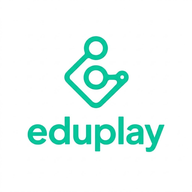

<div align="center">



# EduPlay — Instituto do Saber

**Plataforma educacional gamificada para o Ensino Fundamental**

[](https://react.dev)
[](https://vitejs.dev)
[](https://firebase.google.com)
[](https://web.dev/progressive-web-apps)
[](LICENSE)

🌐 **[eduplay.olloapp.com.br](https://eduplay.olloapp.com.br)**

</div>

---

## 📖 Sobre o Projeto

O **EduPlay** nasceu de uma necessidade real: tornar o aprendizado do Ensino Fundamental mais engajante e eficiente para crianças de 11 a 13 anos, respeitando o currículo da Secretaria Municipal de Educação de São Paulo.

A plataforma transforma o estudo em uma experiência de investigação — a criança é um **Agente Pesquisador** do **Instituto do Saber**, que resolve mistérios e desbloqueia conhecimento através de missões, podcasts e jogos interativos.

---

## ✨ Funcionalidades

- 🏛️ **5 Departamentos** — História, Geografia, Matemática, Ciências e Português
- 🎯 **Sistema de Missões** — baseado no currículo paulista do 6º ano
- 🎙️ **Podcast com Legenda Sincronizada** — narração palavra por palavra
- ❓ **Quiz Interativo** — perguntas com feedback pedagógico imediato
- 🔐 **Forca** — decodificar mensagens secretas
- 🧩 **Sistema de Fragmentos** — moeda de conhecimento exclusiva
- 🏆 **Recompensa Surpresa** — pais configuram meta e recompensa secreta
- ⏱️ **Timer de Estudo** — controle de tempo com bloqueio parental
- 🔒 **Painel dos Responsáveis** — senha master, timer e metas
- 🌙 **Dark Mode / Light Mode** — tema claro e escuro em todas as telas
- 📱 **PWA** — instalável no celular como app nativo
- ♿ **Responsivo** — celular, tablet e desktop

---

## 🧠 Psicologia Educacional Aplicada

O EduPlay foi desenvolvido com base em princípios da psicologia do desenvolvimento para a faixa etária de 11-13 anos:

- **Teoria de Erikson** — identidade em construção: a criança é o protagonista
- **Reforço Positivo Contingente** — recompensas reais configuradas pelos pais
- **Curiosidade como Motor** — cada missão termina com um gancho narrativo
- **Autonomia Controlada** — a criança escolhe qual missão investigar
- **Feedback Imediato** — cada acerto avança a narrativa

---

## 🛠️ Stack Tecnológica

| Tecnologia | Versão | Uso |
|---|---|---|
| React | 18 | Interface e componentes |
| Vite | 5 | Build tool e dev server |
| React Router | 6 | Navegação SPA |
| Firebase Hosting | — | Deploy e CDN |
| Firestore | — | Banco de dados |
| vite-plugin-pwa | 1.2 | Service Worker e manifest |
| Web Speech API | — | Narração com legenda |
| Workbox | — | Cache offline |

---

## 🚀 Como Rodar Localmente

```bash
# Clone o repositório
git clone https://github.com/Thiago-spba/eduplay.git
cd eduplay

# Instale as dependências
npm install

# Rode em desenvolvimento
npm run dev

# Build para produção
npm run build

# Preview do build (com PWA)
npm run preview
```

---

## 📁 Estrutura do Projeto

```
src/
├── components/
│   ├── AudioLesson.jsx    # Podcast com legenda sincronizada
│   ├── BottomNav.jsx      # Navegação inferior responsiva
│   ├── Header.jsx         # Header reutilizável
│   └── LockScreen.jsx     # Tela de bloqueio parental
├── context/
│   └── ThemeContext.jsx   # Dark/Light mode global
├── hooks/
│   ├── useParentLock.js   # Senha e bloqueio parental
│   ├── usePlayer.js       # Nome e avatar do jogador
│   ├── useProgress.js     # Fragmentos e progresso
│   └── useTimer.js        # Timer de estudo
├── pages/
│   ├── HomePage.jsx       # Tela principal — Instituto
│   ├── RegisterPage.jsx   # Registro nome e avatar
│   └── SubjectPage.jsx    # Página de disciplina + jogos
├── services/
│   └── firebase.js        # Configuração Firebase
└── utils/
    └── content.js         # Conteúdo pedagógico 6º ano
```

---

## 📚 Conteúdo Pedagógico

Baseado no **Currículo Paulista / BNCC** para o 6º ano:

**Geografia**
- Localização do Brasil no mundo
- As 5 regiões brasileiras
- Estados e capitais (26 estados + DF)

**História**
- Pré-História e primeiros humanos
- Povos originários do Brasil
- Chegada dos portugueses em 1500

> Em expansão: Matemática, Ciências e Português

---

## 🗺️ Roadmap

- [x] MVP — missões, quiz, forca, podcast
- [x] PWA instalável
- [x] Deploy em produção
- [x] Dark/Light mode completo
- [ ] Painel dos Responsáveis
- [ ] Perfil do Agente + conquistas
- [ ] IA gerando conteúdo automaticamente
- [ ] Sistema de assinatura
- [ ] App nativo (React Native)

---

## 👨‍💻 Autor

**Thiago Fernando**
Engenharia de Computação — Centro Universitário Celso Lisboa

[](https://linkedin.com)
[](https://github.com/Thiago-spba)

---

## 📄 Licença

Este projeto está sob a licença MIT. Veja o arquivo [LICENSE](LICENSE) para mais detalhes.

---

<div align="center">
Feito com ❤️ para transformar o aprendizado em aventura
</div>